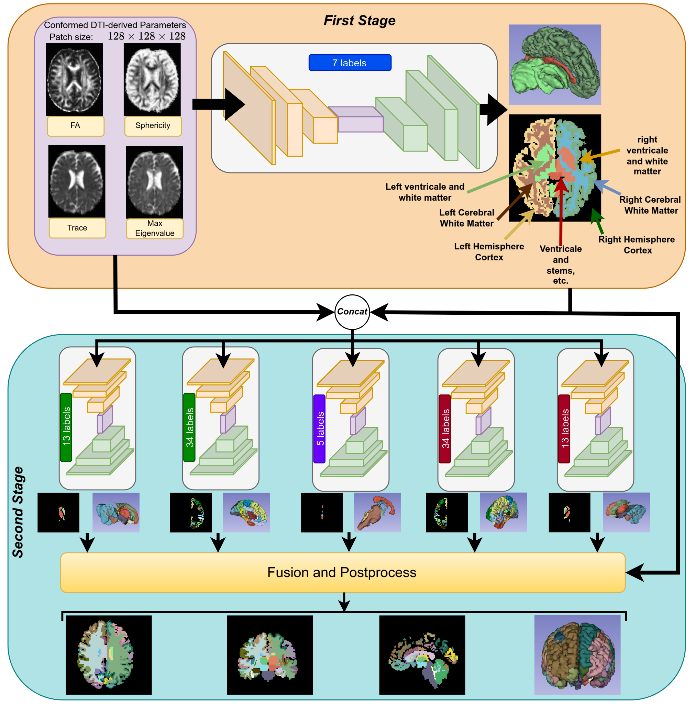
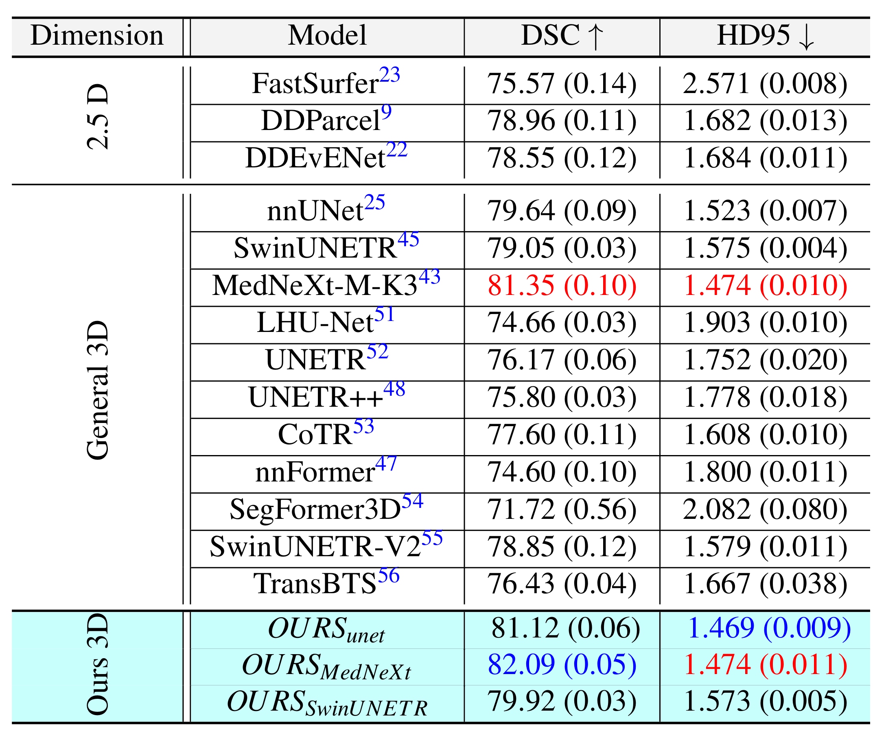
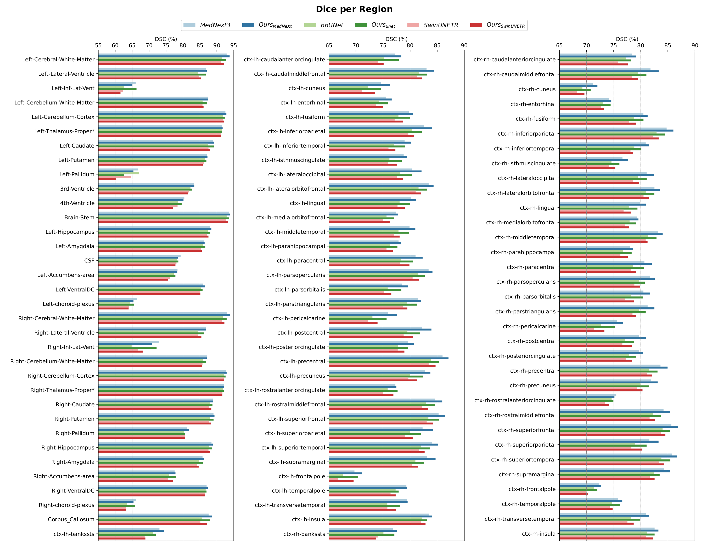

# Deep Learning-Based Desikan-Killiany Parcellation of the Brain Using Diffusion MRI

[](https://arxiv.org/abs/2508.07815)

This repository provides the official implementation of our hierarchical 3D deep learning framework for **Desikan–Killiany brain parcellation** directly in diffusion MRI space. It enables **registration-free segmentation**, optimized through **diffusion feature integration**, and achieves **state-of-the-art performance** across multiple datasets.

> Yousef Sadegheih, and Dorit Merhof

---

## 📑 Table of Contents

1. [Abstract](#-abstract)
2. [Key Contributions](#zap-key-contributions)
3. [Hierarchical Framework](#gear-hierarchical-framework)
4. [Datasets, Pre-trained Weights, and Visualizations](#%EF%B8%8F-datasets-pre-trained-weights-and-visualizations)
5. [Results](#-results)
6. [Getting Started](#-getting-started)
    - [Requirements](#%EF%B8%8F-requirements)
    - [Installation](#-installation)
    - [Training & Inference](#%EF%B8%8F-training--inference)
7. [Acknowledgments](#-acknowledgments)
8. [Citation](#books-citation)

---

## 📝 Abstract
Accurate brain parcellation in diffusion MRI (dMRI) space is essential for advanced neuroimaging analyses. However, most existing approaches rely on anatomical MRI for segmentation and inter-modality registration, a process that can introduce errors and limit the versatility of the technique. In this study, we present a novel deep learning-based framework for direct parcellation based on the Desikan-Killiany (DK) atlas using only diffusion MRI data. Our method utilizes a hierarchical, two-stage segmentation network: the first stage performs coarse parcellation into broad brain regions, and the second stage refines the segmentation to delineate more detailed subregions within each coarse category. We conduct an extensive ablation study to evaluate various diffusion-derived parameter maps, identifying an optimal combination of fractional anisotropy, trace, sphericity, and maximum eigenvalue that enhances parcellation accuracy. When evaluated on the Human Connectome Project and Consortium for Neuropsychiatric Phenomics datasets, our approach achieves superior Dice Similarity Coefficients compared to existing state-of-the-art methods. Additionally, our method demonstrates robust generalization across different image resolutions and acquisition protocols, producing more homogeneous parcellations as measured by the relative standard deviation within regions. This work represents a significant advancement in dMRI-based brain segmentation, providing a precise, reliable, and registration-free solution that is critical for improved structural connectivity and microstructural analyses in both research and clinical applications.

---

## :zap: Key Contributions

- **Hierarchical 3D Deep Learning Framework**: Introduces a two-stage, coarse-to-fine architecture that performs accurate Desikan–Killiany brain parcellation directly from diffusion MRI data, removing the need for anatomical MRI or registration.
- **Optimized Diffusion Feature Selection**: Demonstrates that combining fractional anisotropy, trace, sphericity, and maximum eigenvalue significantly enhances segmentation accuracy and regional homogeneity.
- **State-of-the-Art Performance**: Achieves superior accuracy and generalization across multiple datasets and resolutions, establishing a robust, fully dMRI-based solution for brain parcellation in research and clinical applications.

---

## :gear: Hierarchical Framework

Our method introduces a two-stage hierarchical 3D deep learning framework for direct Desikan–Killiany brain parcellation using diffusion MRI data. The architecture follows a coarse-to-fine segmentation strategy, where the first stage performs broad anatomical division and the second stage refines these regions into detailed cortical and subcortical parcels. This design enables accurate and efficient parcellation without relying on anatomical MRI or inter-modality registration.

<p align="center">
  
</p>

*For an in-depth description of the hierarchical design and training pipeline, please refer to our paper.*

---

## 🗄️ Datasets, Pre-trained weights, and Visualization

the pretrained weights for each of the models that has been used in the framework is available below. 


- [Human Connectome Project (HCP)](https://www.humanconnectome.org/): Used for both training and inference. The data split configuration can be found at: [`splits/splits_final.json`](splits/splits_final.json)
- [Consortium for Neuropsychiatric Phenomics (CNP)](https://openneuro.org/datasets/ds000030/versions/00016): Used for inference only. The list of subjects included in inference is available at: [`splits/CNP_patients.txt`](splits/CNP_patients.txt)

Preprocessing was performed using the **nnU-Net** framework.  
An additional preprocessing notebook for preparing the CNP dataset is provided at [`preprocess/preprocess_CNP.ipynb`](preprocess/preprocess_CNP.ipynb).  
For environment setup and dependencies, refer to the [pnlNipype](https://github.com/pnlbwh/pnlNipype) repository.

Pre-trained weights for all models used in our hierarchical framework, along with corresponding visualizations on the HCP dataset, are available below.

| **Model Used in Framework** | **HCP Visualization** | **Pre-Trained Weights** | 
|-------------|------------------|-------------------------|
   MedNext-k3  | [[Download Visualization](https://myfiles.uni-regensburg.de/filr/public-link/file-download/0447879f997b259d0199ec18d00c7389/144960/-586911353634382492/MedNext_results.zip)]| [[Download Weights](https://myfiles.uni-regensburg.de/filr/public-link/file-download/0447879f997b259d0199ec1b996d7396/144964/-3166282024755160418/MedNext_weights.zip)] 
   SwinUNETR   | [[Download Visualization](https://myfiles.uni-regensburg.de/filr/public-link/file-download/0447879f997b259d0199ec18f4d07391/144961/5381854730903562150/SwinUNETR_results.zip)]| [[Download Weights](https://myfiles.uni-regensburg.de/filr/public-link/file-download/0447879f997b259d0199ec2caacf73c0/144984/-6493034170962535494/SwinUNETR_weights.zip)] 
   U-Net      | [[Download Visualization](https://myfiles.uni-regensburg.de/filr/public-link/file-download/0447879f997b259d0199ec18e318738d/144963/5864779528375949685/unet_results.zip)]| [[Download Weights](https://myfiles.uni-regensburg.de/filr/public-link/file-download/0447879f997b259d0199ec2323b0739d/144985/-3270342698786723335/Unet_weights.zip)] 


## 📈 Results
Our hierarchical 3D deep learning framework achieved state-of-the-art performance in direct Desikan–Killiany brain parcellation from diffusion MRI data.
Compared to existing methods, it consistently delivered higher Dice Similarity Coefficients (DSC) and lower Hausdorff Distances (HD95), while maintaining excellent generalization across multiple datasets and acquisition protocols.
Through an extensive parameter impact study, we also found that combining **Fractional Anisotropy (FA)**, **Trace**, **Sphericity**, and the **Maximum Eigenvalue** yields the most accurate and stable parcellation performance, highlighting the importance of complementary diffusion-derived features.
<p align="center">
  
</p>

<p align="center">
  
</p>


Quantitative and qualitative comparisons on the HCP and CNP datasets demonstrate the superior accuracy and robustness of our method against current state-of-the-art approaches.

## 🚀 Getting Started

This section provides instructions on how to run the Hierarchical Framework for your parcellation tasks. It is built using **nnUNetV2** as its framework.

### 🛠️ Requirements

- **Operating System**: Ubuntu 22.04 or higher
- **CUDA**: Version 12.x
- **Package Manager**: Conda
- **3D Slicer**: [Version. 5.2.2](https://slicer-packages.kitware.com/#collection/5f4474d0e1d8c75dfc70547e/folder/63f5a1888939577d9867aba0) with [SlicerDMRI](https://dmri.slicer.org/) extension
- **Hardware**:
  - GPU with **8GB** memory or larger (recommended)
  - _For our experiments, we used a single GPU (A100-80G)_

### 📦 Installation

To install the required packages and set up the environment, simply run the following command:

```bash
./env_creation.sh
```

This will:

- Create a Conda environment named `DKdMRI`
- Install all the necessary dependencies
- Automatically move the essential files from the `src` folder to the `nnUNetV2` directory

### 🏋️ Training & Inference

To train, prepare your dataset following the **nnU-NetV2** directory structure.  
For inference, use the provided [`inference.ipynb`](./inference.ipynb) notebook.  
A demonstration is also available in the [`demo`](./demo/) folder, which generates the parcellation for a single CNP patient.  
The required demo input can be downloaded [here](https://myfiles.uni-regensburg.de/filr/public-link/file-download/0447879f997b259d0199edd26971768d/144994/-2002564335920255796/sub-10217.zip).


## 🤝 Acknowledgments

This repository is built based on [DDParcel](https://github.com/zhangfanmark/DDParcel/tree/main), [nnU-Net](https://github.com/MIC-DKFZ/nnUNet), [DDEvENet](https://github.com/d0ng231/DDEvENet), [pnlNipype](https://github.com/pnlbwh/pnlNipype). We thank the authors for their code repositories.

## :books: Citation

If you find this work useful for your research, please cite:

```bibtex
@article{sadegheih2025deep,
  title={Deep Learning-Based Desikan-Killiany Parcellation of the Brain Using Diffusion MRI},
  author={Sadegheih, Yousef and Merhof, Dorit},
  journal={arXiv preprint arXiv:2508.07815},
  year={2025}
}
```

